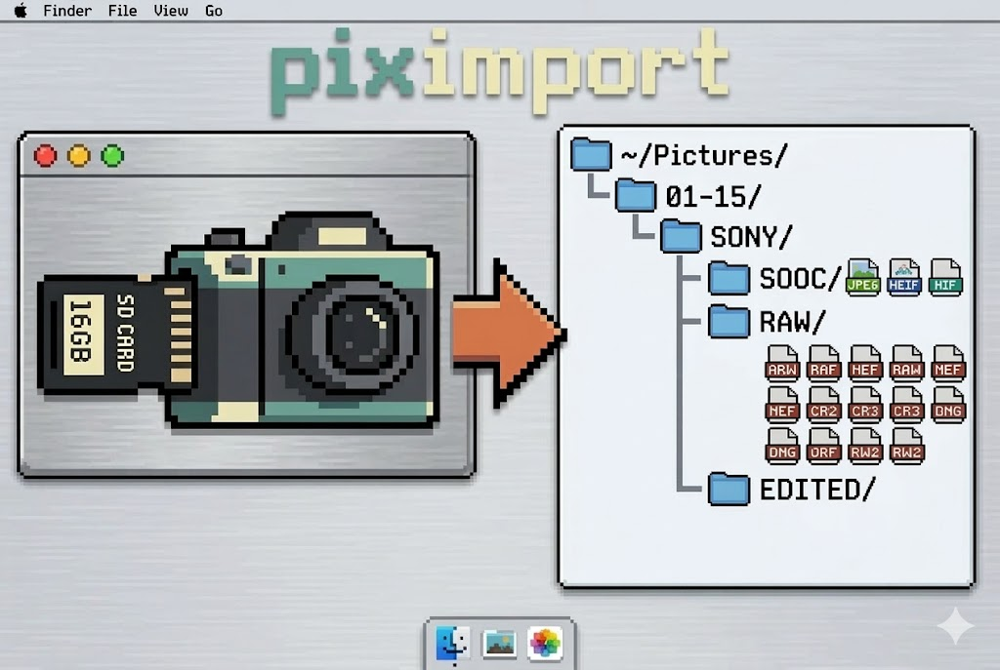

# piximport



CLI tool to import photos from SD cards to `~/Pictures`, automatically
organised by EXIF date and camera make.

## Destination structure

```
~/Pictures/
└── 2026/
    └── 01-15/
        └── SONY/
            ├── SOOC/    ← JPEG, HEIF, HIF
            ├── RAW/     ← ARW, RAF, NEF, CR2, CR3, DNG, ORF, RW2
            └── EDITED/  ← empty, ready for your editing workflow
```

## Installation

### With pipx (recommended — isolated, no changes to the global environment)

```bash
pipx install piximport
```

### Directly from GitHub

```bash
pipx install git+https://github.com/suarez605/piximport.git
# or a specific version:
pipx install git+https://github.com/suarez605/piximport.git@v1.0.0
```

### With pip

```bash
pip install piximport
```

## Usage

```bash
piximport
```

The CLI automatically detects connected SD cards, shows an interactive
day selector, and copies photos while preserving filesystem metadata.

## Supported formats

| Type | Extensions |
|------|------------|
| SOOC | `.jpg` `.jpeg` `.heif` `.heic` `.hif` |
| RAW  | `.arw` `.raf` `.nef` `.cr2` `.cr3` `.dng` `.orf` `.rw2` |

## Requirements

- macOS (uses `/Volumes` and `diskutil`)
- Python 3.11+

## Development

```bash
git clone https://github.com/suarez605/piximport
cd piximport
python3.11 -m venv env
source env/bin/activate
pip install -e .
python -m unittest tests -v
```
